# 黄焖土鸡

> 颜色金黄、酱香浓郁，经典家常焖鸡做法——小火慢焖锁住土鸡的鲜嫩，配上软糯的土豆和香菇，是一道让人停不下筷子的下饭硬菜。

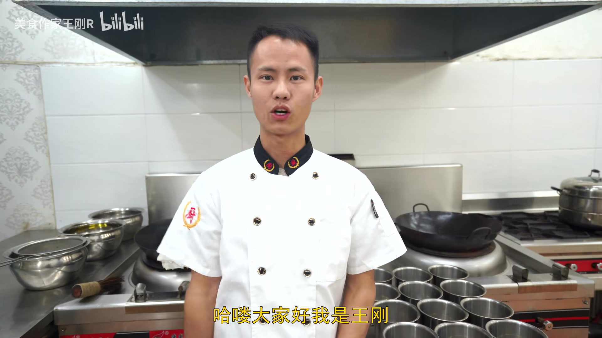

---

## 🛒 食材

**主料：**
- 土鸡（或三黄鸡）— 半只（约600-800g）

**辅料：**
- 土豆 — 1个（切大块）
- 大红椒 — 1个
- 香菇 — 几个（约4-6朵）
- 生姜 — 1小块
- 小葱 — 几根
- 蒜头 — 适量（切小块）

**调料：**
- 冰糖 — 适量（用于炒糖色）
- 生抽酱油 — 3g（约半茶匙）
- 蚝油 — 3g（约半茶匙）
- 老抽 — 2g（少许，用于上色）
- 食用盐 — 约1小半勺
- 胡椒粉 — 少许
- 明油（熟油）— 少许
- 食用油 — 适量

---

## 👨‍🍳 步骤

### 1. 处理鸡肉

将土鸡切掉鸡屁股和鸡脚趾（这两个部位腥味重，建议去除）。把鸡翅和鸡脚单独切下，再将整鸡剁成大小均匀的小块备用。剁块时尽量保持大小一致，方便后续均匀受热。

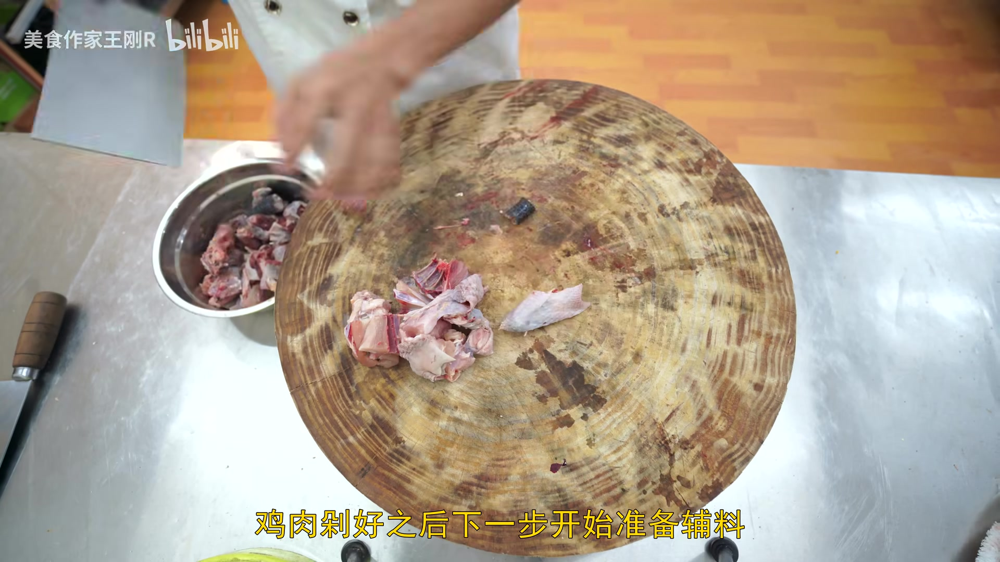

### 2. 准备辅料

- **土豆**：去皮后切成稍大的块，块大一些不容易在焖制过程中散碎；
- **大红椒**：去蒂、去辣椒籽后切成小片备用（后期增色用，不宜过早下锅）；
- **香菇**：切成小块备用；
- **生姜**：切成姜粒备用；
- **小葱**：挽成葱结备用；
- **蒜头**：切成小块备用。

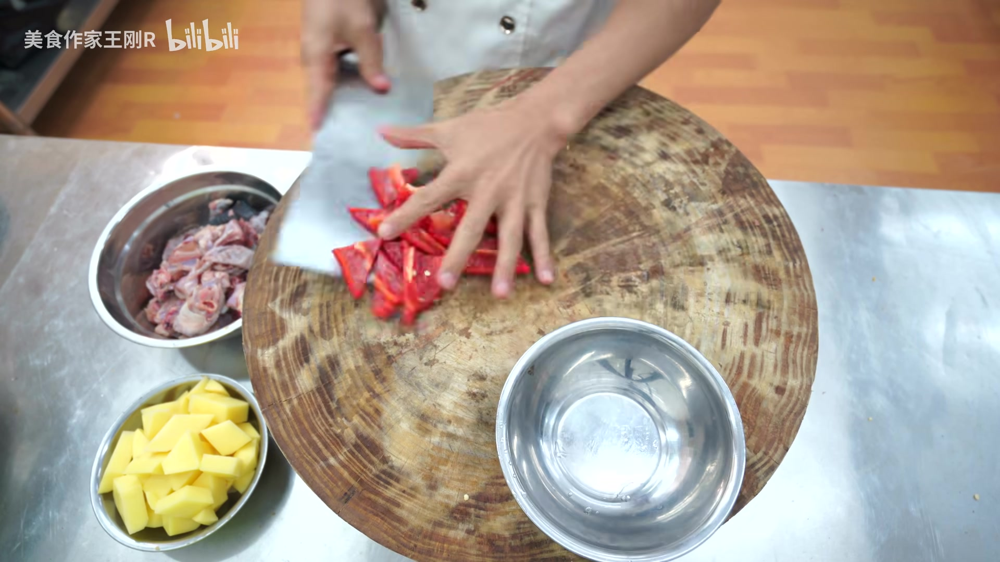

### 3. 炸土豆

锅烧热后加入较宽裕的食用油，待油温升至**4成热**（约120°C，筷子插入油中有细小气泡冒出）时，将切好的土豆块下锅，**全程不开大火**，中小火炸约3分钟，炸至土豆熟透后捞出备用。

> ⚠️ 此步骤火候不能过大，否则土豆外焦里生。

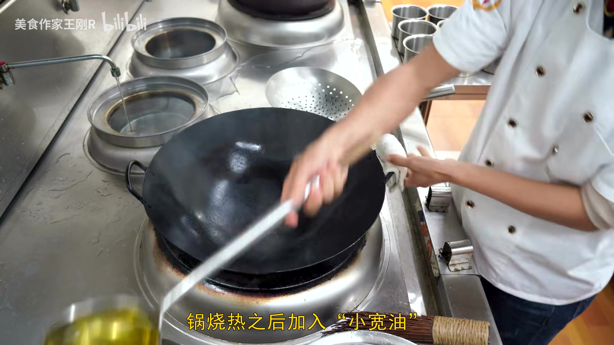

### 4. 炸鸡块

保持锅中的油，转大火将油温升至**7成热**（约210°C，油面有轻微烟雾）。将剁好的鸡块下锅，**快速炸约20秒**后立即捞出备用。这一步的目的是将鸡肉表面迅速收紧，锁住内部鲜味，而非将鸡肉炸熟。

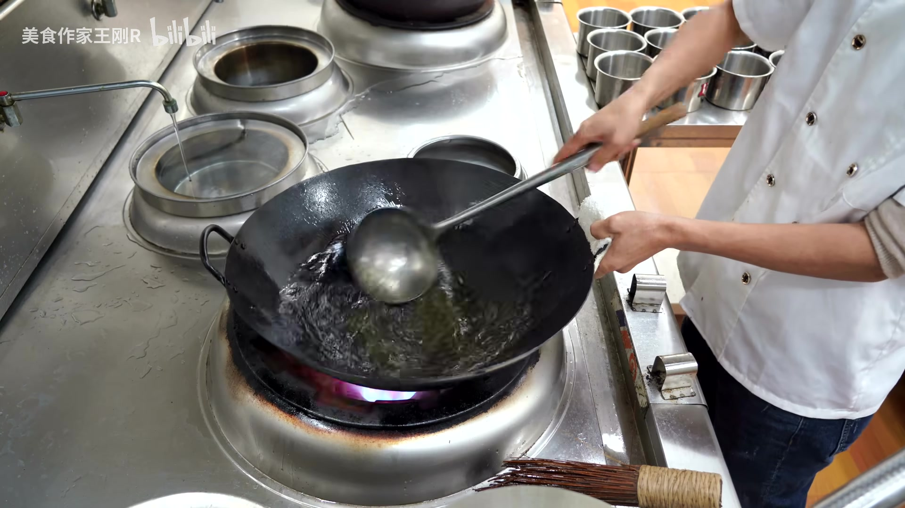

### 5. 炒糖色

将锅中多余的油倒出，留少许底油烧热。转**小火**，加入适量冰糖，用铲子不断翻炒，待冰糖完全融化并炒至呈红棕色糖色时，立即进行下一步，避免炒糊变苦。

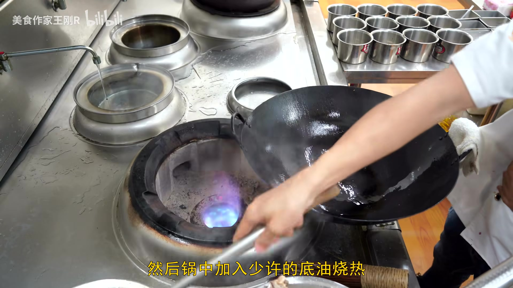

### 6. 鸡块上色调味

将炸好的鸡块倒入锅中，与糖色翻炒上色。中途加入切好的**姜粒**和**蒜块**，翻炒出香味。

待鸡肉充分上色后，沿锅边依次淋入：
- 生抽酱油 3g
- 蚝油 3g
- 老抽 2g

转小火翻炒均匀，让酱料充分包裹鸡肉。

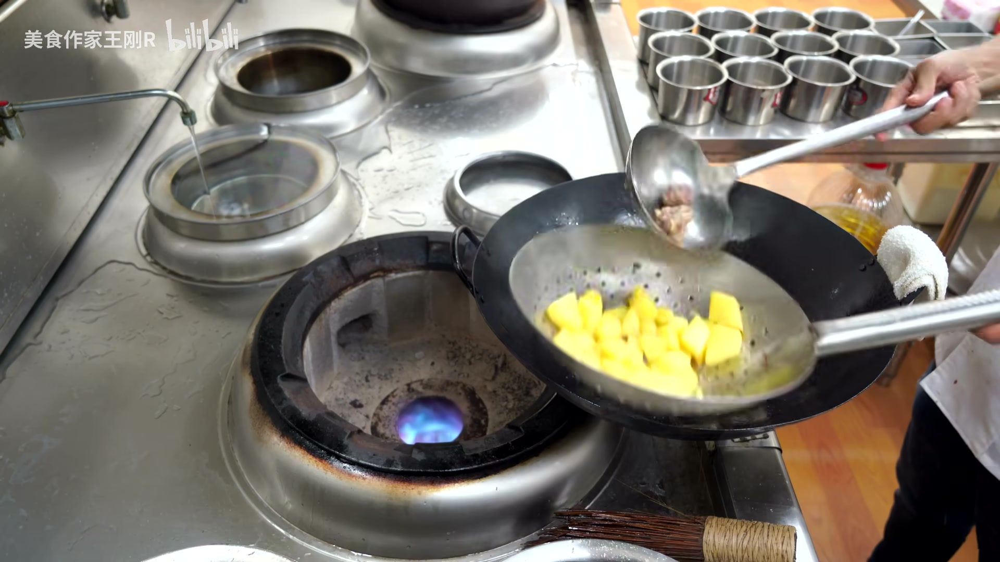

### 7. 加水焖制

向锅中加入适量清水，水量以**刚好没过鸡块**为准。大火烧开后，盖上锅盖，转**小火焖制30分钟**。

> 💡 小火慢焖是黄焖鸡的灵魂步骤，切勿心急开大火，否则汤汁收干过快，鸡肉难以充分入味。

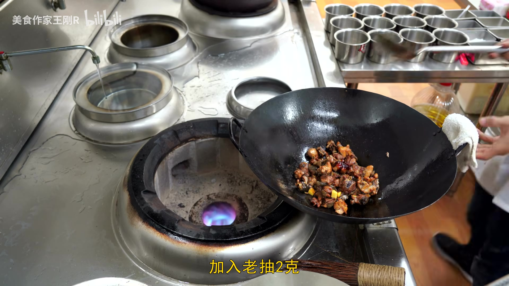

### 8. 加入辅料继续焖

焖制约**20分钟**时，揭开锅盖，加入**葱结**、炸好的**土豆块**和**香菇块**，翻炒均匀后盖盖继续小火焖制。

### 9. 起锅前调味

起锅前约**3分钟**开始调味：加入食用盐约1小半勺、少许胡椒粉，翻匀后继续盖盖焖3分钟，让味道充分渗入食材。

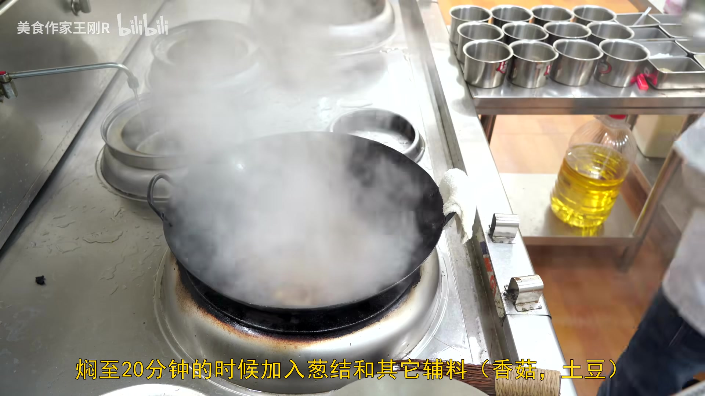

### 10. 收尾出锅

3分钟后揭开锅盖，加入切好的**红椒片**和少许**明油**，大火翻炒至红椒断生（约1分钟），即可出锅装盘。

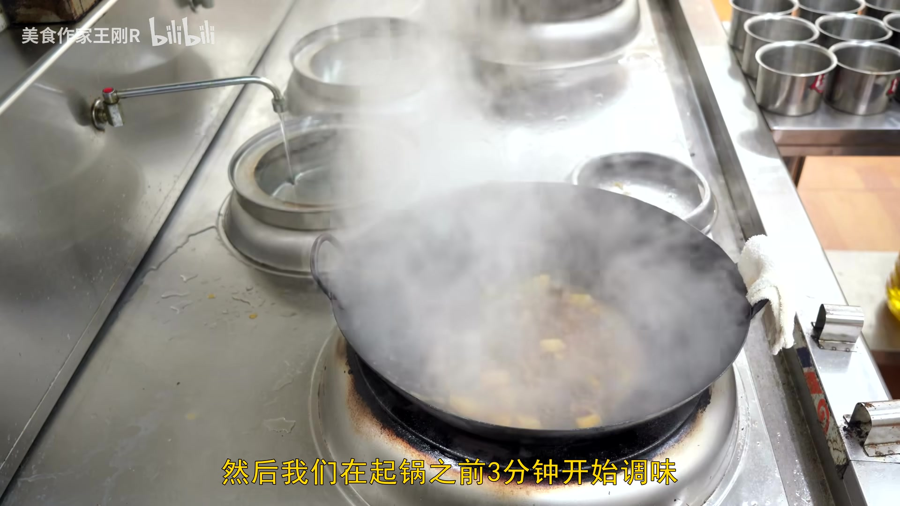

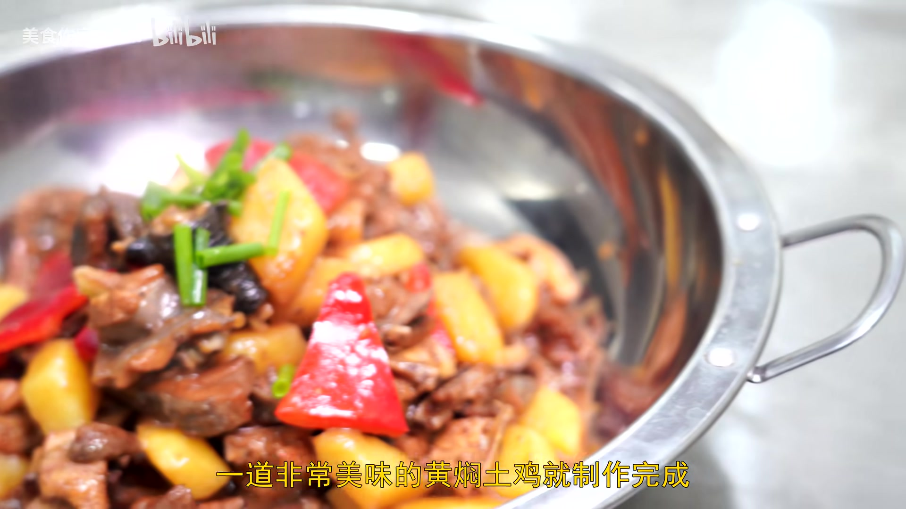

---

## 💡 烹饪技巧

- **炸鸡块只需20秒**：这一步不是为了炸熟，而是快速锁紧鸡肉表面，让后续焖制时鲜味不流失，时间不可过长。
- **糖色要小火慢炒**：冰糖炒糖色必须用小火，全程注意观察颜色变化，炒至红棕色立即下鸡，否则糊掉会发苦。
- **土豆切大块**：土豆块宜切得稍大，经过30分钟焖制后恰好软糯，切太小容易焖化散碎影响口感。
- **小火焖制是关键**：全程维持小火，让鸡肉在微沸的汤汁中慢慢吸收酱香，这是黄焖鸡"焖"字的精髓所在。
- **红椒最后放**：红椒仅用于增色提鲜，出锅前放入断生即可，过早加入会导致颜色变暗、口感软烂。

---

## 📝 小贴士

- **鸡肉替换**：没有土鸡也可以用三黄鸡代替，土鸡肉质更紧实Q弹，三黄鸡则更嫩滑，两种风味各有千秋。
- **省略油炸步骤**：家庭小灶若不方便宽油炸制，可省略炸土豆和炸鸡块的步骤，土豆直接在焖制时加入，鸡块直接用糖色翻炒上色即可，成品风味略有不同但同样美味。
- **水量控制**：加水以刚没过鸡块为宜，加多了汤汁寡淡、不够浓郁；加少了容易中途烧干，焖制过程中途可以适当观察补水。
- **辅料可灵活搭配**：香菇、土豆是经典搭配，也可以加入板栗、腐竹、青椒等食材，丰富口感层次。
- **老抽用量要少**：老抽主要用于调色，用量控制在2g以内，加多了颜色发黑，影响成品金黄的卖相。