# 山东炒鸡

> 山东泰安非遗认证的地方名菜，生炒锁鲜、四酱合璧，咸香打底、微麻微辣点睛，鸡肉紧实甘香，汁浓味厚，是一道极具地方特色的下饭硬菜。

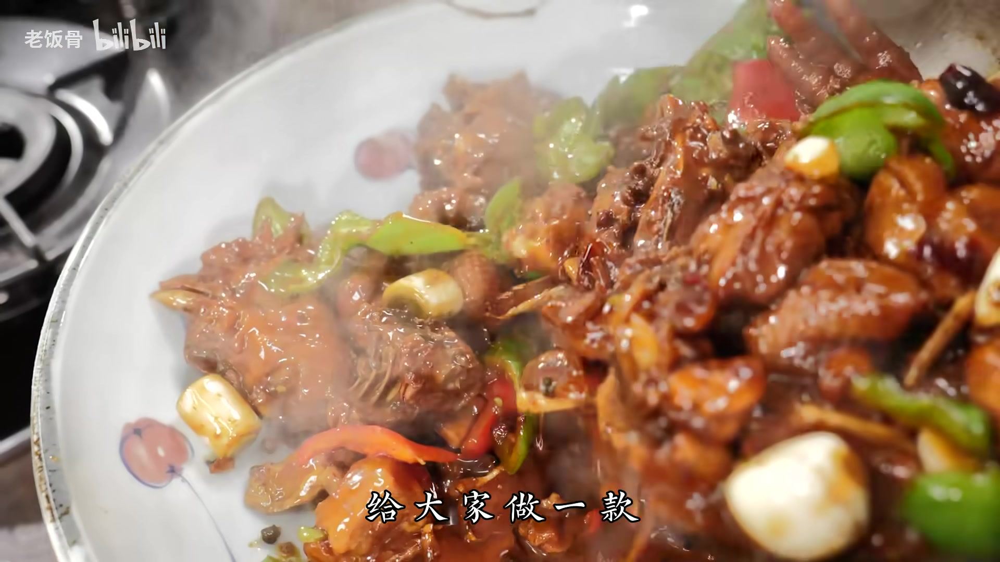

---

## 🛒 食材

**主料：**
- 嫩小公鸡 — 1只（约1.2–1.5kg，选用较嫩的小公鸡）

**新鲜辅料：**
- 螺蛳椒 — 适量（滚刀块）
- 红尖椒（美人椒）— 适量
- 大蒜 — 适量（拍散即可）
- 生姜 — 适量（不去皮，切片，用量宜多）
- 大葱 — 适量（切段）

**香辛料：**
- 八角 — 适量
- 花椒 — 适量
- 干辣椒 — 适量
- 白芷 — 适量

**调料（家用版比例）：**
- 黄豆酱 — 80g
- 甜面酱 — 40g
- 黄豆酱油（酿造） — 40g
- 蚝油 — 20g
- 冰糖 — 少许
- 老抽 — 少许（提色）
- 味精 — 1勺
- 鸡粉 — 1勺
- 白糖 — 半勺
- 食用油 — 适量
- 开水 — 适量（没过鸡肉即可）

---

## 👨‍🍳 步骤

### 1. 食材准备与切配

将小公鸡斩成块，大小均匀，便于受热均匀、快速成熟。

生姜**不去皮**，切片，用量要多——"炒鸡不放姜，神仙也炒不香"是山东炒鸡的第一句口诀。姜带皮使用，可发挥其热性，帮助去腥增香，且香味持久。

大蒜无需切碎，用刀轻拍一下即可。螺蛳椒切滚刀块，红美人椒切段，大葱切段，备用。

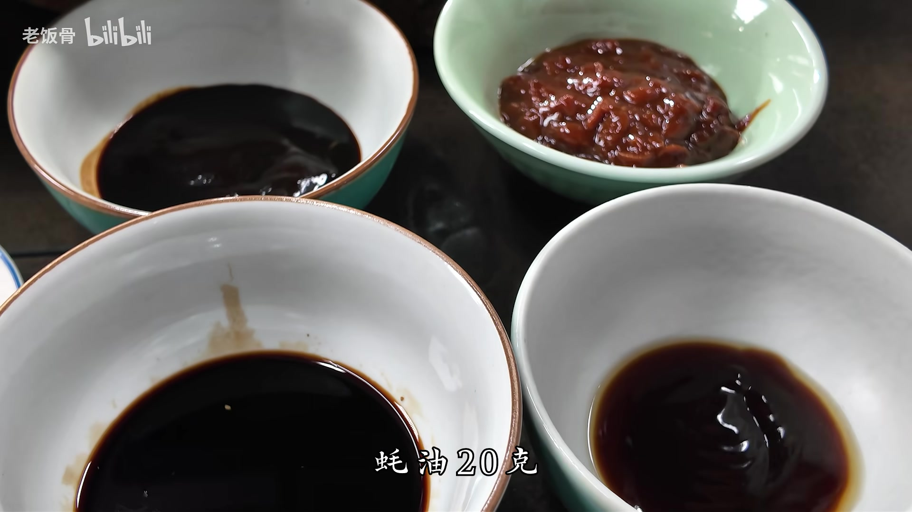

---

### 2. 煸炒姜片出香

锅中倒入足量食用油，冷油下姜片，**中小火慢慢煸炒**，将姜片中的水分逐渐煸干，直至姜片边缘出现轻微金黄色。

> 此步骤要耐心，让姜的香气充分释放到油中，是整道菜香气的基础。

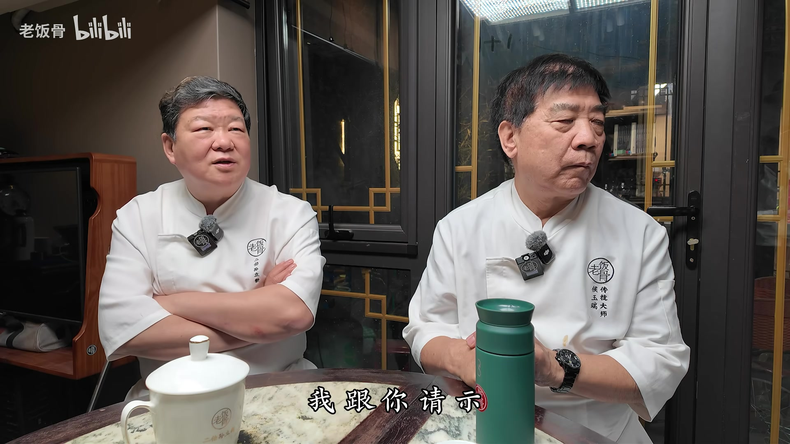

---

### 3. 爆香香辛料

姜片煸至金黄后，**调小火降低油温**，随即将八角、花椒、干辣椒、白芷等香辛料下锅爆香。

以辣椒的颜色变化为判断标准——**辣椒变色即可**，只要辣椒不糊，其他香辛料就不会糊。爆香时动作要快，时刻注意火候。

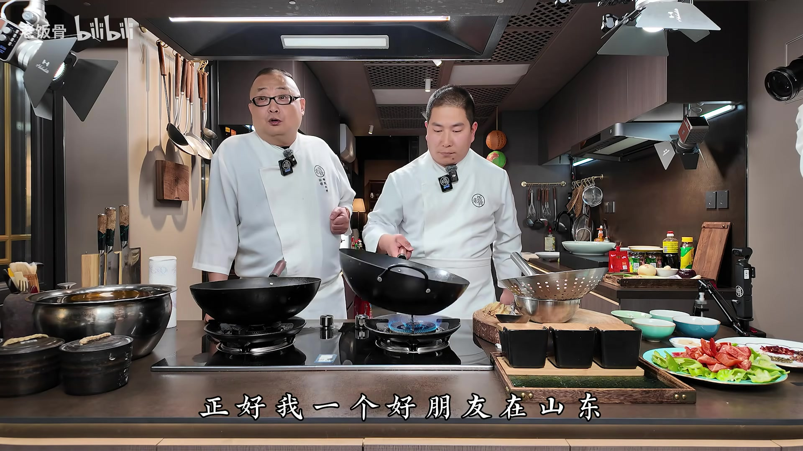

---

### 4. 下鸡肉，生炒定型

香辛料爆香后，立即将鸡块倒入锅中，**先不要翻动**，让鸡肉在高油温下短暂定型，待底部略微成型后再翻炒。

> 山东炒鸡的核心技法是**生炒**——先煸料再下鸡肉，高温瞬间激发香辛料的香气，对鸡肉的提香效果极佳。这与"先煸鸡后搁料"的做法相比，香味层次更为丰富。

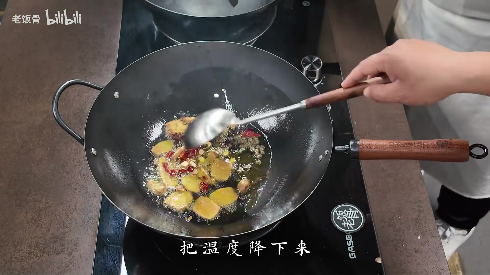

---

### 5. 炒至水分收干、油色清亮

保持大火，持续翻炒鸡块，将鸡肉自身的水分彻底炒出并蒸发。

**判断标准：** 锅中的油由浑浊变得**清亮透明**，即说明鸡肉中的水分已基本炒干，此时鸡肉紧实，是下酱的最佳时机。

> 这是王师傅分享的关键鉴别方法：油浑浊说明水分还在，油清亮说明水分已蒸发干净。

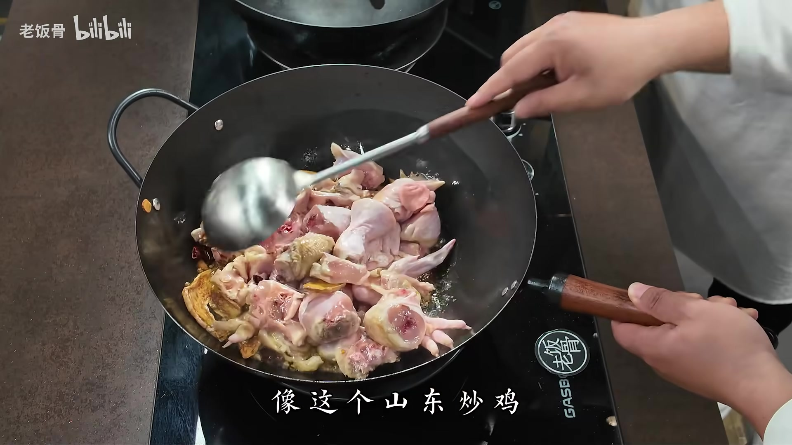

---

### 6. 下四种酱料，炒匀裹香

调小火，依次将**黄豆酱（80g）、甜面酱（40g）、蚝油（20g）、黄豆酱油（40g）**全部加入锅中，同时可加少许老抽提色、冰糖提鲜。

用锅铲充分翻炒，让酱料均匀裹覆在每一块鸡肉上，并将酱料稍微**炒熟一下**，去除生酱味。

> 这四种酱料均需选用**酿造型**产品，切勿使用含大量添加剂的勾兑酱油或酱料，否则鲜香大打折扣。四酱各司其职：提色、提鲜、提香，相互平衡，共同构成山东炒鸡的灵魂。

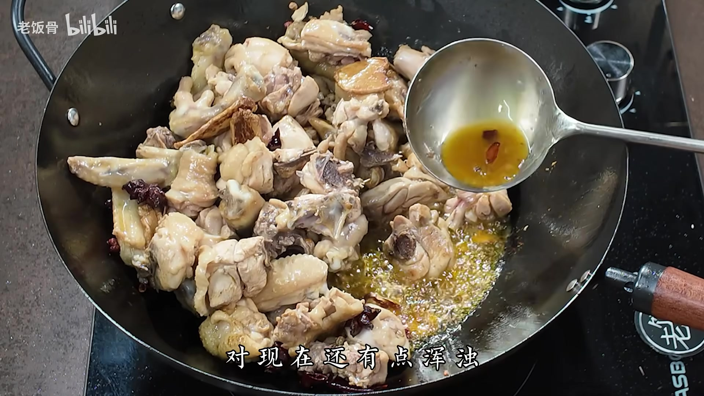

---

### 7. 加开水焖煮入味

酱料炒匀后，加入**适量开水**，水量以**略微没过鸡肉**为宜。大火烧开，待锅中冒出蒸汽后，盖上锅盖，转**中火焖煮约10分钟**，使鸡肉充分吸收酱料与香辛料的味道，彻底成熟入味。

> 必须加**开水**而非冷水，以保持锅内温度稳定，避免鸡肉因骤然降温而变柴。

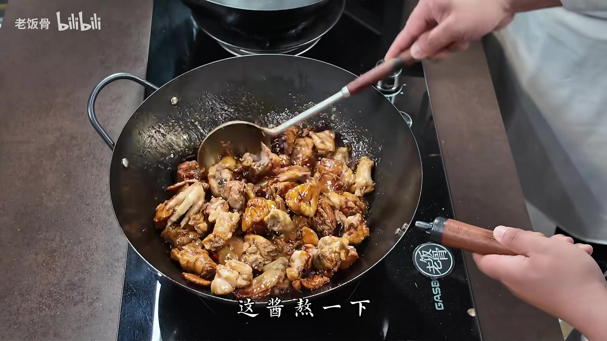

---

### 8. 开盖收汁，补味调味

焖煮完成后，开盖转大火收汁，同时加入**味精1勺、鸡粉1勺、白糖半勺**补味提鲜。

持续翻炒收汁，直至锅中汤汁**大量减少、呈粘稠状，出现较多小气泡**，说明汁已收好。

> 收汁阶段只要不糊锅，可以多收一会儿，汁越浓稠，挂在鸡肉上的酱香味越浓郁。

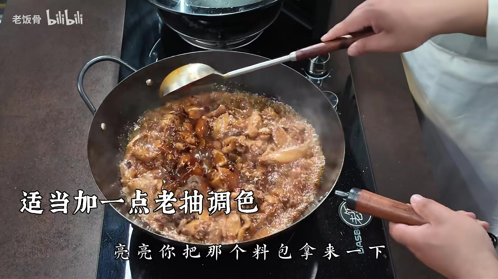

---

### 9. 下新鲜蔬菜，翻炒出锅

汁收至粘稠后，将提前备好的**螺蛳椒、红美人椒、葱段、拍蒜**全部下锅，大火翻炒均匀。

无需将蔬菜完全炒断生，只需**炒至热透、不再生凉**即可关火，保留蔬菜的清脆口感与鲜香气息。

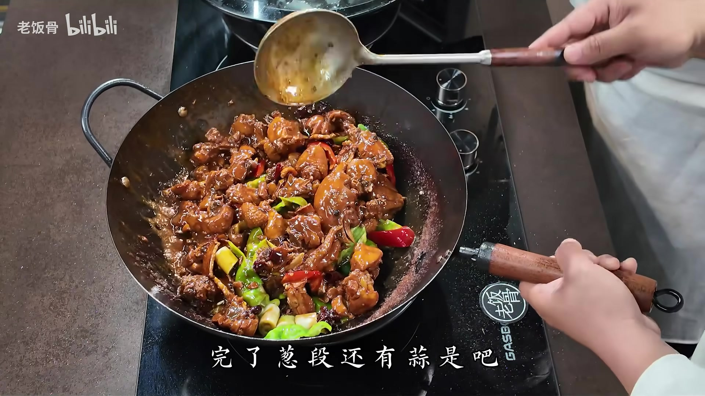

---

### 10. 装盘上桌

关火后立即装盘，色泽红亮，酱香扑鼻。

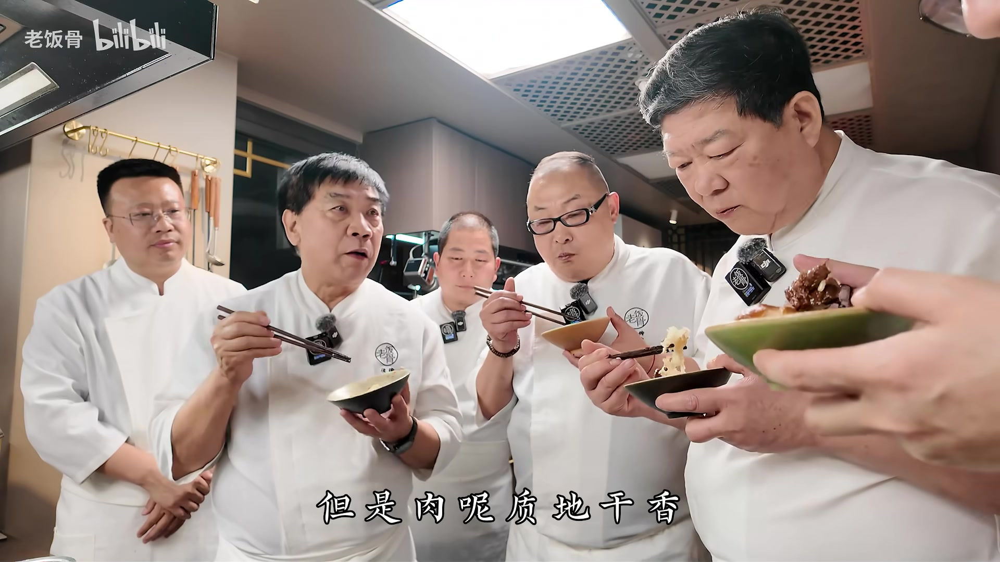

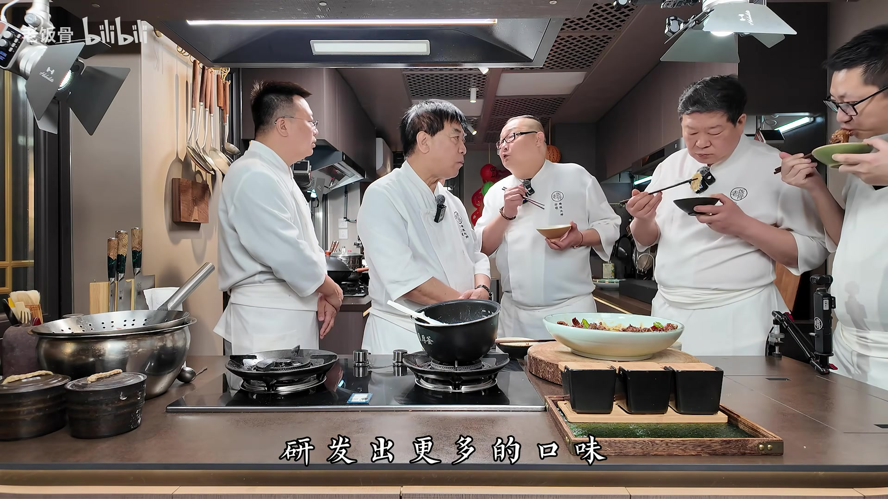

---

## 💡 烹饪技巧

- **生炒是关键**：山东炒鸡的精髓在于生炒——先将姜片和香辛料在油中充分爆香，再下生鸡块，高温瞬间激发香气，鸡肉的鲜味被完整封锁，炒出水分后肉质紧实甘香。
- **油色判断水分**：炒鸡过程中，锅中油色由浑浊变清亮，是鸡肉水分炒干的最直观信号，此时方可下酱，避免酱料被多余水分稀释。
- **姜不去皮**：生姜带皮使用，发挥其热性，去腥效果更好，香味更加持久，且与鸡肉的热性相配合。
- **四酱平衡**：黄豆酱、甜面酱、蚝油、黄豆酱油四种酱料缺一不可，共同构成咸、鲜、甜、香的复合底味，互相平衡。
- **先煸料后下鸡**：与一般做法不同，此菜要先充分煸炒姜和香辛料，让香气充分转移到油中，再下鸡肉，整体香味层次更深。
- **收汁判断**：锅中汤汁出现大量粘稠小泡、量已极少时，是下新鲜蔬菜的最佳时机，此时下菜既能保留蔬菜鲜味，又能吸附浓稠酱汁。

---

## 📝 小贴士

- **鸡的选择至关重要**：必须选用**嫩小公鸡**，口感嫩滑，成熟时间短。不适合使用老母鸡、遛养鸡或跑山鸡等有韧劲的鸡，这类鸡筋多，生炒难以成熟，需要高压锅处理，不是此菜的做法。
- **酱料必须是酿造型**：黄豆酱油等调料务必选用纯酿造产品，勾兑酱油含添加剂多，会破坏整道菜的鲜香风味。
- **辣度可按口味调整**：视频使用螺蛳椒和红美人椒，辣度温和，喜辣者可增加干辣椒用量或改用薄皮辣椒，风格更接近林沂炒鸡。
- **商用版香辛料更丰富**：家用版以八角、花椒、干辣椒、白芷为基础已足够；商用或追求更复杂香气时，可将更多香辛料研磨成粉使用。
- **山东炒鸡的地域差异**：山东每个地级市都有自己特色的炒鸡风味。其中林沂炒鸡以辣著称，现多用薄皮辣椒；泰安炒鸡则以本视频风格为代表，并已获得地理标志认证。
- **此菜下酒下饭皆宜**：酱香、咸鲜、微麻微辣的口味层次，配米饭或作下酒菜均十分出色，是年节家宴的好选择。