# 黄金蛋炒饭两吃——金包银 & 狂野回忆版

> 同一碗米饭，两种截然不同的灵魂——一个清雅，粒粒裹蛋香；一个豪迈，酱油猪油锅气足。一条视频，把蛋炒饭的所有细节讲透。

---

## ⚡ 快速指南

| 项目 | 详情 |
|------|------|
| 烹饪时间 | 15 分钟 |
| 准备时间 | 5 分钟 |
| 难度 | ⭐⭐☆☆☆ |
| 份量 | 2 人份（每版各 1 份）|

---

## 🛒 食材清单

> 以下食材可同时准备两个版本；若只做其中一版，各取一半即可。

**主料：**
- 隔夜米饭（或放凉的米饭）：2 碗（约 400 克）
- 鸡蛋：4 个（两版各 2 个）
- 葱花：适量（两版共用，分两次下锅）

**【金包银版】调料：**
- 花生油：适量（稍多，约 2 汤匙）
- 盐：适量

**【狂野回忆版】调料：**
- 猪肥肉（用于炼猪油）：适量，约 100 克；或直接用花生油代替
- 花生油：少量（炒蛋用）
- 酱油：适量（约 1 汤匙）
- 盐：少量（底味用）
- 葱花：适量

---

## 📋 详细步骤

---

### 【通用准备】第一步：处理米饭——让每粒米都裹上蛋液

米饭必须是**完全放凉**的，刚从冰箱拿出来的冷冻米饭反而不行——大米粒冻过之后加热会渗水，蛋液就裹不上去了。

将 2 个鸡蛋的**蛋黄**（金包银版）取出，直接拌入米饭中，用手将蛋黄均匀揉入，直到每一粒米饭都裹上金黄色的蛋液，米饭轻轻一扒就能散开为止。

> **关键点：** 米饭一定要提前放至室温，不烫手、不结冰，这是蛋炒饭粒粒分明的基础。

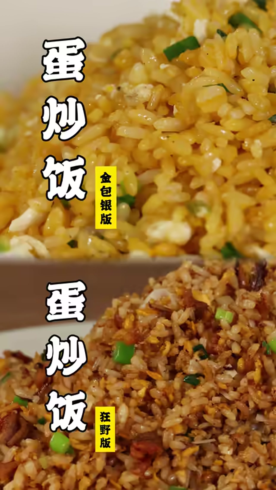

---

### 【通用准备】第二步：清洁炒锅——锅净才能炒出纯粹的味道

将炒锅烧热，用厨房纸或反复空烧的方式将锅内壁的杂色、残留油脂彻底清除。看似刷干净的锅，高温下仍会有残留，务必认真处理。

> **为什么要这么做？** 锅内残留的杂质会影响蛋白的色泽与炒饭的纯净香气，尤其是狂野版对锅的洁净度要求极高。

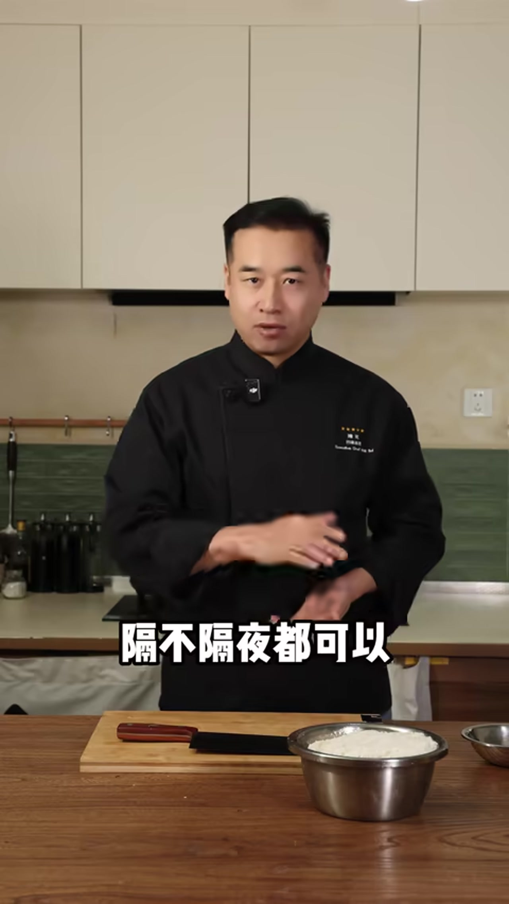

---

## 🥚 金包银蛋炒饭（规矩版）

### 第三步：炒蛋白——凉油下锅，润透锅边

锅烧热后，倒入**稍多的花生油**（油量要足，蛋香味才能充分释放），油不必烧到冒烟，**凉油直接下锅**也可以。

将剩余的 2 个鸡蛋**只取蛋白**打散，倒入热锅，边炒边用铲子贴着锅边转动，将油脂均匀润满整口锅。蛋白炒散后，可以看到锅底更加光洁。

> **小技巧：** 花生油炒鸡蛋，能将鸡蛋的香味激发得更浓、更纯。油一定不能少，否则蛋香出不来。

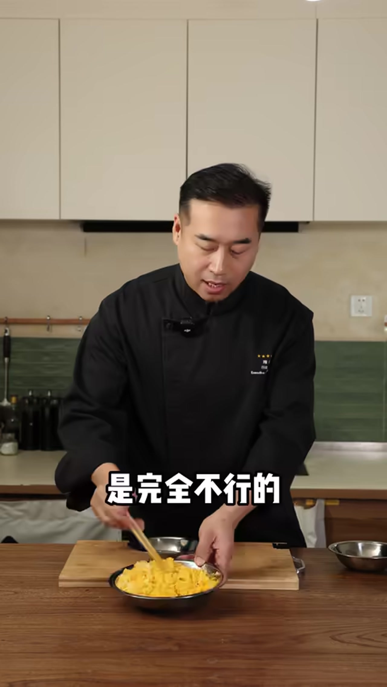

---

### 第四步：放盐——在米饭下锅前加盐

蛋白炒散后，**此时**在锅中加盐，而不是最后出锅前加。这样盐会均匀融入油脂和蛋香中，炒出来的米饭里外都有味道，不会表面咸、内部无味。

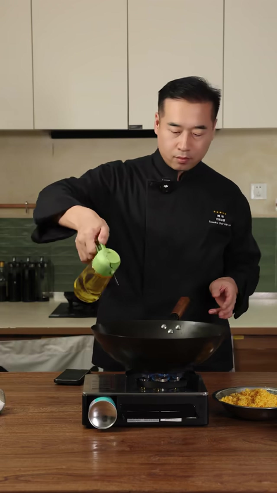

---

### 第五步：下裹蛋黄的米饭，大火翻炒

将第一步裹好蛋黄的米饭倒入锅中，**大火**快速翻炒，用铲子将米饭炒散，让蛋液在高温下迅速凝固包裹每粒米，形成金黄色的外壳——这就是"金包银"名称的由来。

炒至米粒在锅中跳动、听到轻微的"噼啪"声，说明水分已经炒干，锅气到位。

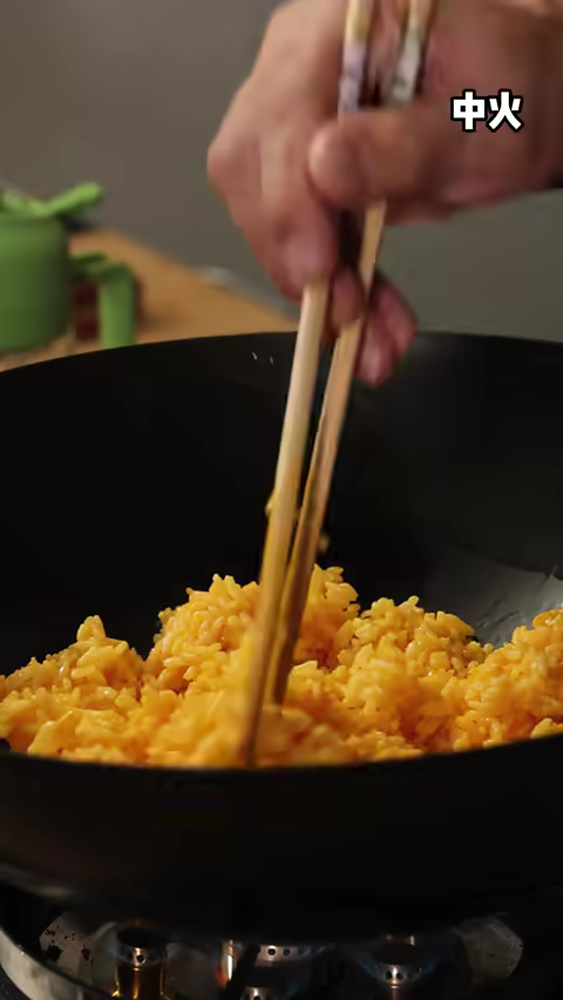

---

### 第六步：加葱花，翻炒出锅

倒入葱花，快速翻炒均匀，即可出锅装盘。

> **成品特点：** 米粒金黄，颗颗分明，蛋香浓郁纯净，口感清雅，每一粒米都裹满蛋香，单靠盐和蛋香就足以撑起整碗的风味。

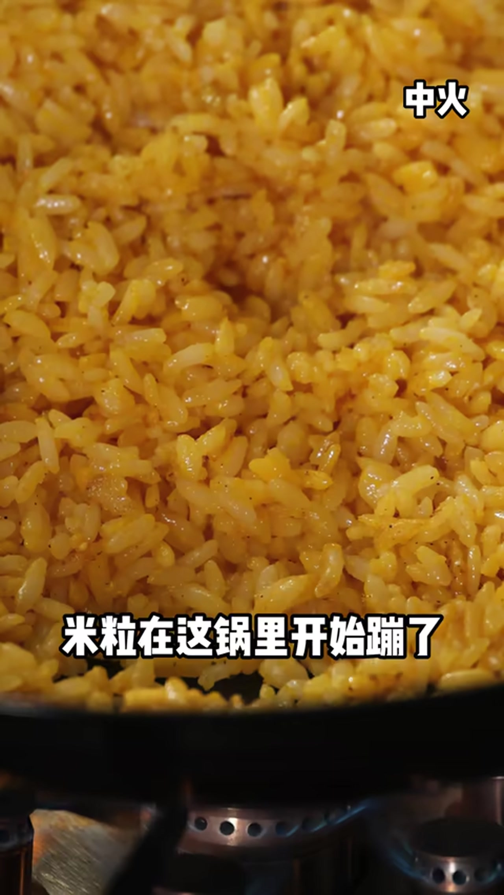

---

## 🔥 狂野回忆版蛋炒饭（猪油酱油版）

### 第七步：炼猪油、炸油渣——灵魂所在

取适量猪肥肉切小块，冷锅冷油下入，小火慢慢将肥肉中的油脂逼出。**一定要炸到油渣呈焦黄色**，这样油渣才会特别香、特别酥。

炼出的猪油备用，油渣撒少量盐给底味，同样备用。

> **没有猪肥肉？** 用花生油代替完全可以，但香气层次会稍有不同——这是童年的味道，无可替代。

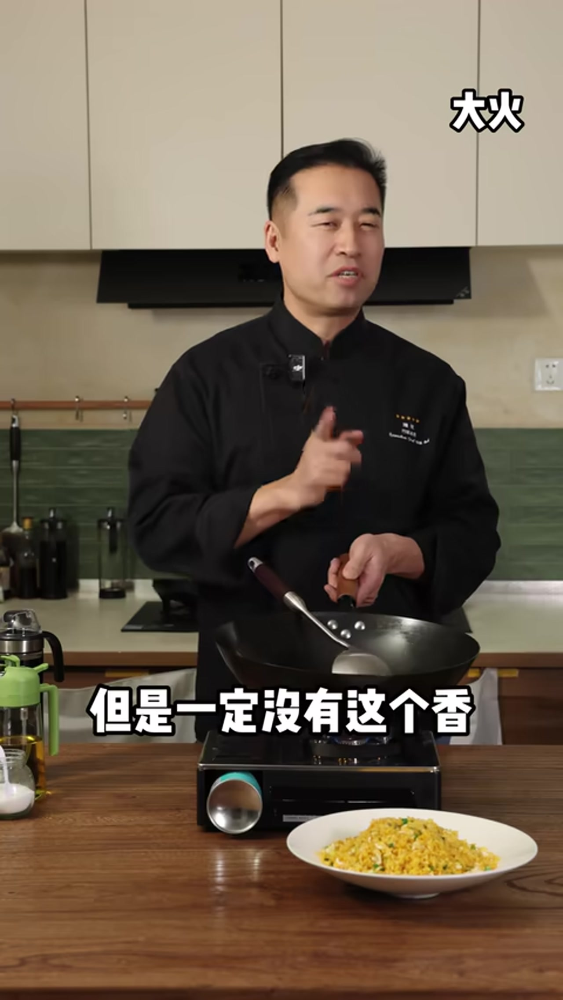

---

### 第八步：爆香葱花——火一定要大

锅中放少量花生油烧热，**火开到最大**，倒入一半葱花，快速爆炒，将葱花的香味充分激发出来。

> **为什么要大火？** 大火才能在短时间内逼出葱花的焦香，而不是把葱花"煮"熟，失去锅气。

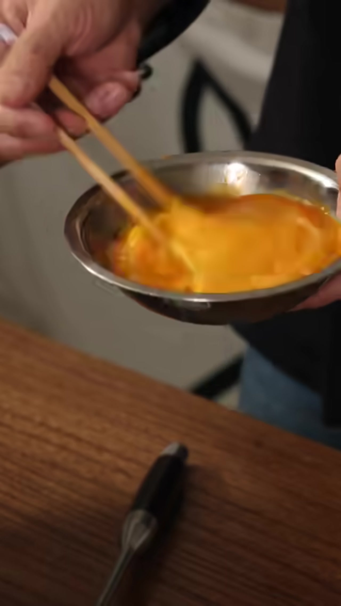

---

### 第九步：炒鸡蛋，控好油温

将 2 个鸡蛋打散，倒入锅中快速翻炒。**油温的控制非常关键**：油温过低，鸡蛋腥味无法挥发；油温过高，鸡蛋炒老发硬。

鸡蛋刚凝固、还有些嫩的时候，**立刻**倒入米饭，不要等鸡蛋完全炒熟。

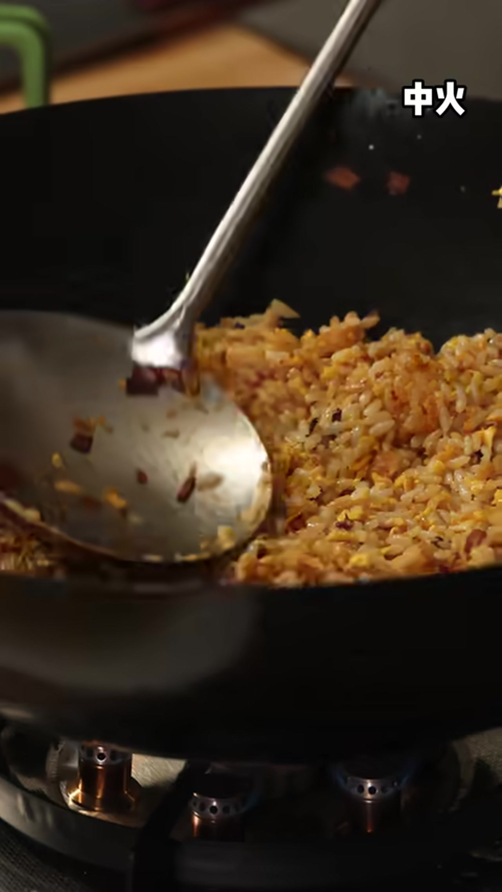

---

### 第十步：下米饭，大火猛炒出锅气

将米饭倒入锅中，用铲子用力翻炒，将米饭与鸡蛋充分混合炒散。

过程中可以用铲子**用力拍压**米饭，让米饭充分接触锅底，炒出焦香和锅气，同时这个动作可以将锅底的杂质"拍"起来，翻炒均匀。

> **不要怕锅气大或"拔锅"（轻微粘锅）！** 轻微的焦香感正是狂野版区别于普通炒饭的精髓所在，这才叫够味。

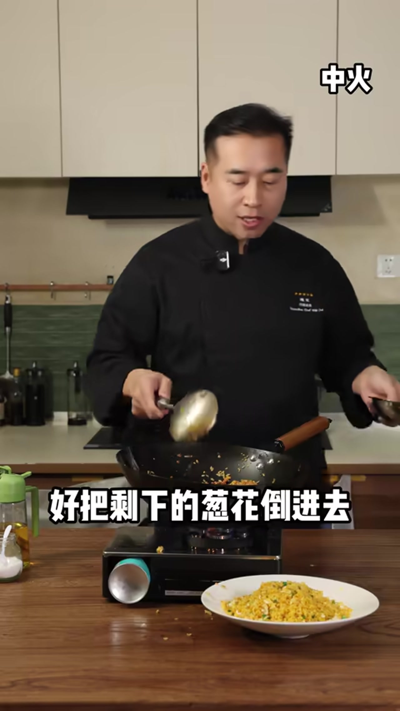

---

### 第十一步：淋入酱油，炒香炒透

沿锅边淋入适量酱油（不要直接浇在米饭上），让酱油接触热锅后瞬间激发出酱香，再翻炒均匀，将颜色和香气均匀裹在每粒米上。

继续大火翻炒，直到米饭颜色均匀、香气扑鼻，每粒米都有轻微的酥脆感。

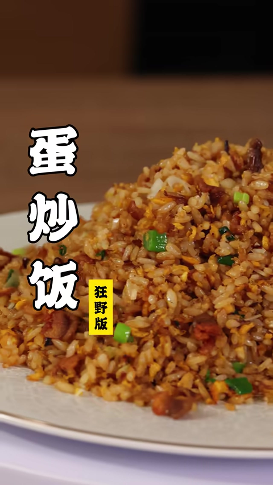

---

### 第十二步：倒入猪油与油渣，撒葱花出锅

将第七步炼好的猪油淋入锅中，倒入焦黄酥脆的油渣，再撒入剩余的葱花，快速翻炒均匀，立刻出锅。

> **成品特点：** 米粒因猪油而油润光泽，酱油香气浓郁，油渣酥脆解馋，葱花清香收尾，口感层次复合丰富。深夜饥饿时炒上一锅，吃得特别爽。

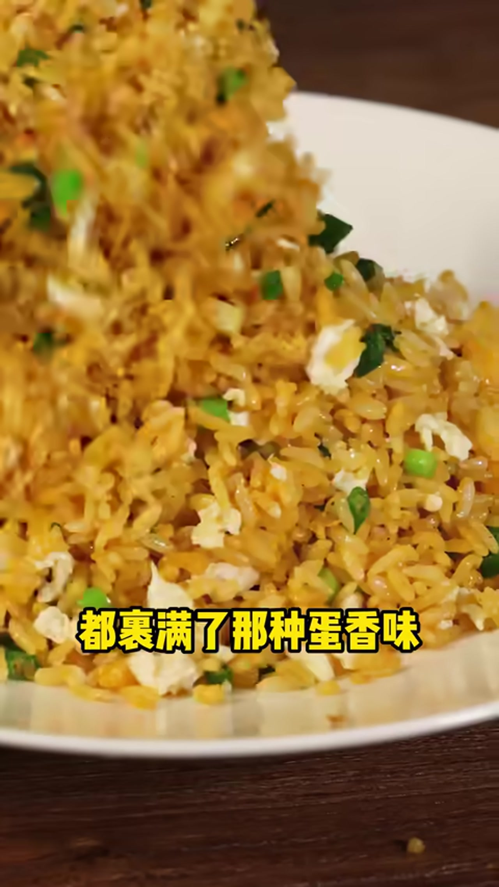

---

## 💡 小贴士

- **米饭温度是第一关键**：室温放凉的米饭最佳；刚出锅的热饭太烫会越炒越粘；刚从冰箱取出的冷冻米饭会渗水，蛋液裹不上去。
- **蛋黄拌饭要揉透**：金包银的关键在于用手将蛋黄充分揉入每粒米，而非简单搅拌，粒粒金黄才叫金包银。
- **油量要足**：无论哪个版本，油少了鸡蛋香味都出不来，不要为了"健康"而过分减油。
- **盐要早放**：在米饭下锅之前加盐，让盐融入油脂，炒出里外都有味的米饭；最后补盐只能调表面咸淡。
- **锅一定要干净**：有杂色残留的锅会影响炒饭的颜色和纯净风味，开炒前务必处理干净。
- **酱油沿锅边淋入**：让酱油先接触热锅壁激发焦香，而非直接浇在米饭上，这是酱油炒饭锅气的来源之一。
- **油渣要炸到焦黄**：颜色不够深的油渣口感软烂，炸到微微焦黄才酥脆香浓，是狂野版的灵魂配料。
- **两版风格对比**：金包银清雅纯粹，适合细品；狂野版复合浓郁，适合解馋——同样的食材，风格完全不同，值得都试一试。

---

## 🔗 原视频

- **来源：** 金包银or锅气蛋炒饭？一个视频教你们成为蛋炒饭大王！
- **链接：** https://www.bilibili.com/video/BV15QPCzGEMy/