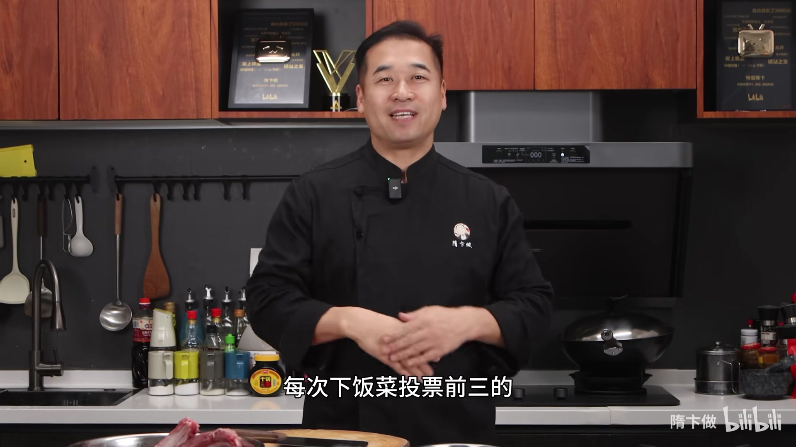
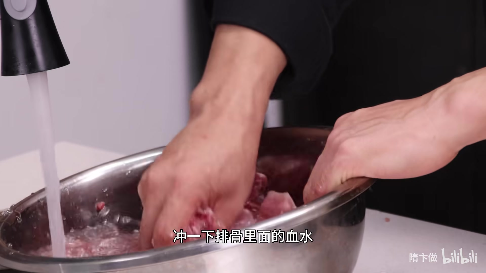
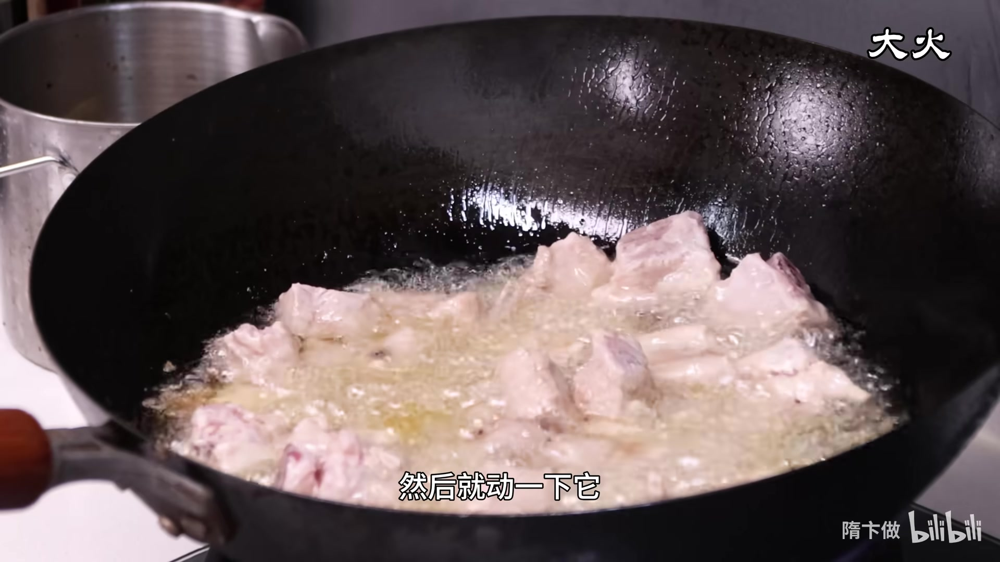
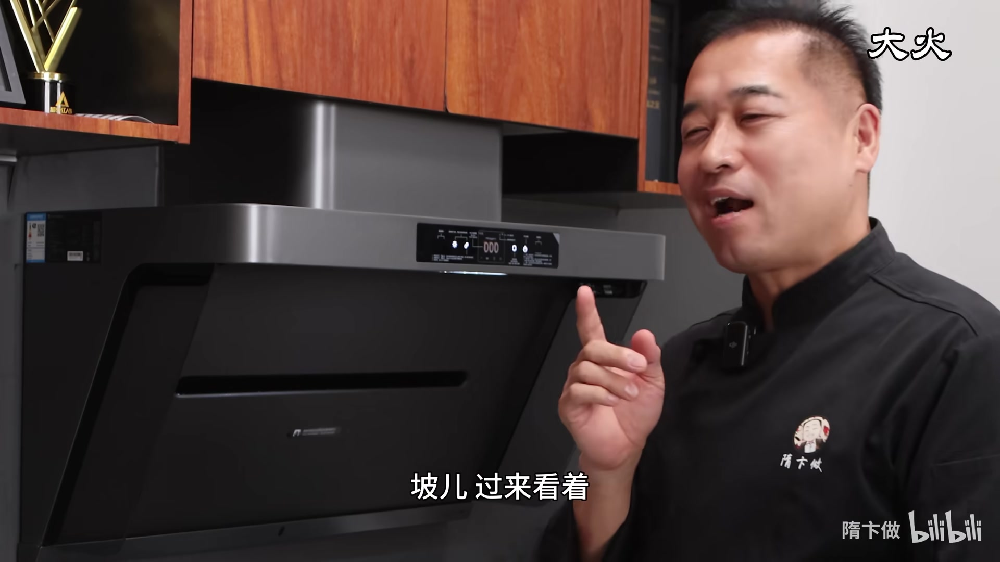
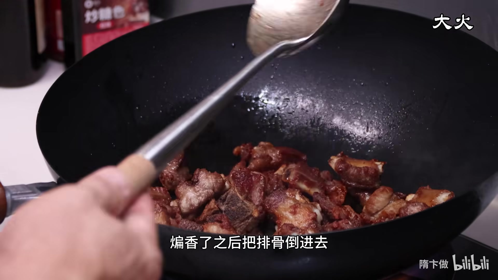
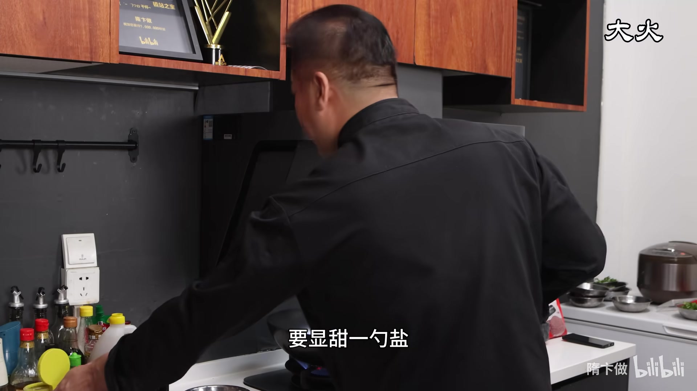
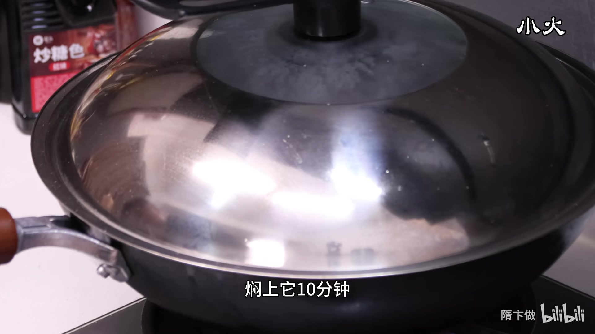
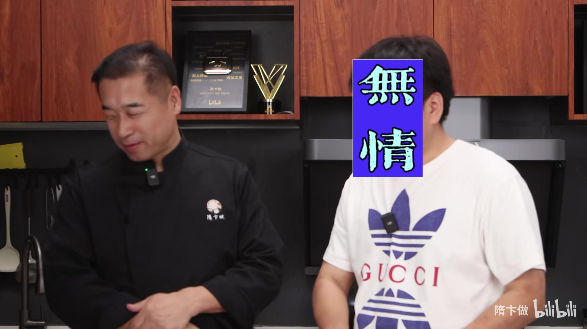
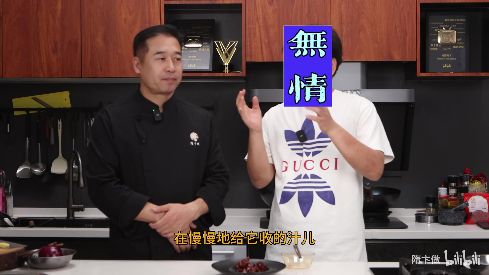
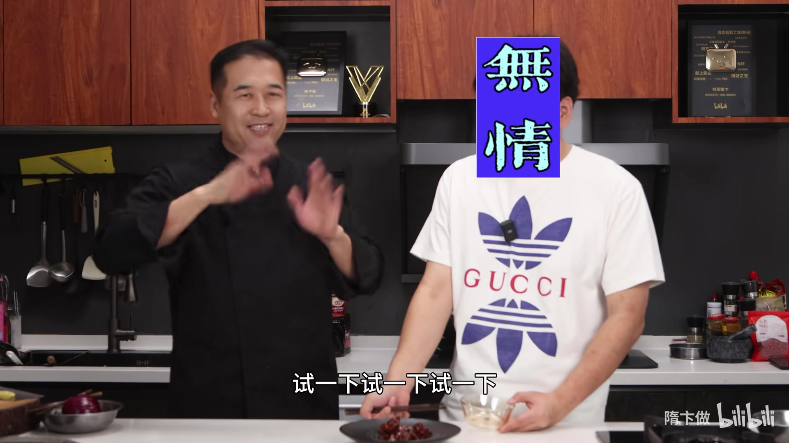

# 糖醋排骨

> 特厨版糖醋排骨——排骨先炸至金黄脱水，再用冰糖、米醋小火焖煮收汁，外层微焦酥香、内里软嫩不柴，酸甜口味拿捏得恰到好处，是票选前三的超级下饭菜。

## 🛒 食材

**主料：**
- 猪腔排骨 — 500g

**辅料/调料：**
- 花雕酒（花雕/料酒） — 适量（闻着有酒香即可）
- 淀粉 — 适量（薄薄一层）
- 食用油 — 适量（煎炸用）
- 葱 — 2-3段
- 姜 — 3-4片
- 大料（八角） — 1-2个
- 花椒 — 一小撮
- 桂皮 — 1小块
- 米醋 — 约3大勺（分两次使用）
- 冰糖 — 约30g
- 焦糖色（老抽） — 少许（调色用）
- 盐 — 1勺
- 老抽 — 少许（收汁时调色）

## 👨‍🍳 步骤

### 1. 排骨处理

选用猪腔排骨，剁排骨时注意不要从外面直接剁下去，那样会把肉挤碎。应尽可能**翻着剁**，这样能保持肉质完整。剁好后用清水冲洗一下排骨里的血水。

### 2. 腌制排骨

在排骨中少放一点花雕酒，简单去腥，闻着有酒香味就够了。将排骨腌匀后，在表面**拍上薄薄一层淀粉**，不需要太厚，薄薄一层即可。

### 3. 煎炸排骨

热锅凉油，油温起来后将排骨倒入锅中煎炸。这一步的关键目的是**让排骨脱水，把表面多余的油脂炸掉**，这样排骨后续才能重新吸收糖醋汁的味道。

下锅后不要着急翻动，先炸1-2分钟，等排骨定型后再翻面。判断是否定型的方法：晃动锅子，排骨能自己滑动就说明没有粘锅，可以翻动了。

继续炸至排骨**表面金黄、有焦黄感**，然后捞出控油。

### 4. 炒香料头

将锅中多余的油倒出，重新留少许底油，加入**葱、姜、大料、花椒、桂皮**，小火煸炒出香味。

### 5. 加排骨调味

香料煸香后，将炸好的排骨倒回锅中。依次加入：

- **花雕酒** — 烹入去腥增香
- **米醋** — 主体酸味来源（尽量选择米醋或香醋，陈醋味道和颜色都会偏重）
- **冰糖** — 提供甜味
- **焦糖色（少许老抽）** — 辅助调色，增加甜感
- **盐** — 一勺，定底味

加入适量清水，大火烧开，将冰糖全部烧化溶解。

### 6. 小火焖煮

此时汤汁较多，酸甜味会偏薄偏淡，这是正常的。**现在尝起来只有一点点酸甜味就对了**，因为后续收汁后味道会浓缩。如果现在就调到你觉得酸甜合适的程度，收完汁就会过浓。

盖上锅盖，转**小火焖煮约10分钟**，让排骨充分入味。

### 7. 大火收汁

焖煮到时间后，揭盖转**大火收汁**。如果颜色稍浅，可以加一点**老抽**调色。

汁收到浓稠挂在排骨表面时，**快出锅前再烹入少许醋**，激出一股醋香味，这是点睛之笔。

### 8. 出锅装盘

收汁完成，排骨外层微焦酥香，内里软嫩多汁，装盘即可上桌。

## 💡 烹饪技巧

- **排骨一定要炸，而且要炸够火候**：这是这道菜的关键。炸的目的是脱水、去除多余油脂，让排骨表面形成一层微焦的壳，后续才能充分吸收糖醋汁的味道。如果不炸或炸得不够，排骨表面含水，口感会发软，酸甜味也挂不住。
- **醋分两次加**：第一次跟调料一起加，参与焖煮入味；第二次在出锅前烹入，激发醋的香气，让成品闻起来更有层次。
- **调味时汤汁阶段要偏淡**：因为收汁后味道会成倍浓缩，前期太浓后面就没法吃了。初始阶段只要有一点点酸甜味即可。
- **米醋优于陈醋**：米醋或香醋酸味柔和、颜色浅，更适合糖醋排骨。陈醋味道重、颜色深，调色时需要格外注意。

## 📝 小贴士

- **剁排骨的方向**：不要从外侧直接砍下去，要翻着剁，避免把肉挤碎散掉。
- **炸排骨不要急着翻**：下锅后等1-2分钟让表面定型，晃锅能滑动再翻，否则容易粘锅掉粉。
- **冰糖 vs 白糖**：冰糖熬出的色泽更亮、甜味更醇厚，是糖醋类菜肴的首选。
- **关于焦香感**：炸到位的排骨会带有一点点焦香味，但因为后续用水慢慢焖煮收汁，里面的肉不会发柴，反而外酥内嫩。